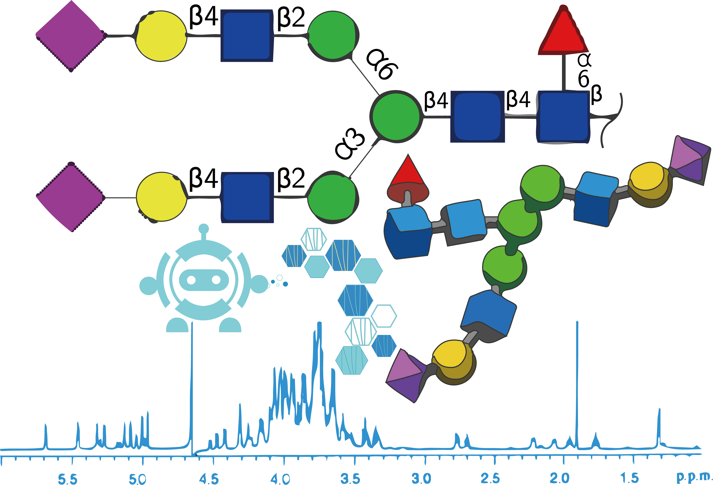

<p align='center'>
  
</p>

# GlycoNMR - Domain Adaptation

Pretrain a 2D / 3D GNN model on simulation dataset and fine tune on experimental dataset. 

## Datasets:

The two curated datasets discussed in the paper, click the link to download each one. 

### 1. Collected and simulated carbohydrate datasets (uncurated, before ML pipeline): 

The raw datasets in format of Protein Data Bank (PDB) 3D coordinate structure files with corresponding NMR shift files. Designed for glycoscience researchers with standard format for experimental files.

This raw data is difficult and risky to use as is in machine learning research, as we have done substantial curation after obtaining this raw data. For ML pipelines, please instead use the downloads "2. Processed carbohydrate datasets" below. We have just provided this raw uncurated data for completion and openness.

All raw data was accessible through publicly available sources that allowed open use as long as proper citation was given.

- GODESS experimentally-informed simulation data can be can be downloaded [here](https://drive.google.com/file/d/15qIixe-irZyJKzvuoINuK1-d53nC8Jyh/view?usp=sharing) and was obtained from http://csdb.glycoscience.ru/goddess.html, see our 2023 manuscript and http://csdb.glycoscience.ru/database/index.html?help=nmr#citation for more information <br />

- The complete list of chemical formulae of the carbohydrates included in our GODESS dataset can be viewed in text format here: [GODESS_Chemical_formula.csv](https://github.com/Cyrus9721/GlycoNMR/files/12384105/GODESS_Chemical_formula.csv)

- See appendix of manuscript for higher level summaries of the data.

- Glycoscience.DB experimental data can be downloaded [here](https://drive.google.com/file/d/1z6OMzvvALq8rOZBWAW5C9yBr_UBQ__ZT/view?usp=sharing). This data was downloaded from the open access, publicly available Glycosciences.DB website discussed in this publication, Böhm, Michael, et al. "Glycosciences. DB: an annotated data collection linking glycomics and proteomics data (2018 update)." Nucleic Acids Research 47.D1 (2019): D1195-D1201. , with download criteria given in our 2023 manuscript. <br />

### 2. Processed carbohydrate datasets (heavily curated, ready for ML research):

Processed and annotated tabular datasets we provide in the 2023 manuscript. Designed for machine learning researchers. 

Our manuscript is the first use case of these datasets and we provide them for open access use with proper citation according to the corresponding Github license our repository. This Github is the central location where the data will be maintained. Please address inquiries to the manuscript authors.

- Processed GODESS can be downloaded [here](https://drive.google.com/file/d/1rapUjHs0hhjNfsNMkap3bAdwdNPE2vXA/view?usp=sharing). <br />
- Processed Glycoscience.DB can be downloaded [here](https://drive.google.com/file/d/1z6OMzvvALq8rOZBWAW5C9yBr_UBQ__ZT/view?usp=sharing). <br />

## Usage of GlycoNMR dataset:

These datasets were used for the first time in our 2023 manuscript to predict NMR 1D chemical shift peaks from PDB structure files of carbohydrates. We hope experimental researchers especially will help us continue to grow this dataset in the future, and that future work will further hone prediction of NMR spectra from structure as done here, and, vice versa, also predict structure from NMR spectra of carbohydrates which is a priority goal to add into the pipeline (see Next Steps below).

### Python environment with a requirements.txt

Install all required python libraries:
```bash
pip install requirements.txt
```

## Domain Adaptation of GlycoNMR dataset: 20% train, 80% test

|           | GlycoNMR.Exp C Shift | GlycoNMR.Exp_pretrain C Shift | GlycoNMR.Sim |
|-----------|----------------------|-------------------------------|--------------|
| MLP | 4.822±0.068          | 4.323±0.015                   | 1.859        |


##### This work was supported by GlycoMIP, a National Science Foundation Materials Innovation Platform funded through Cooperative Agreement DMR-1933525.
